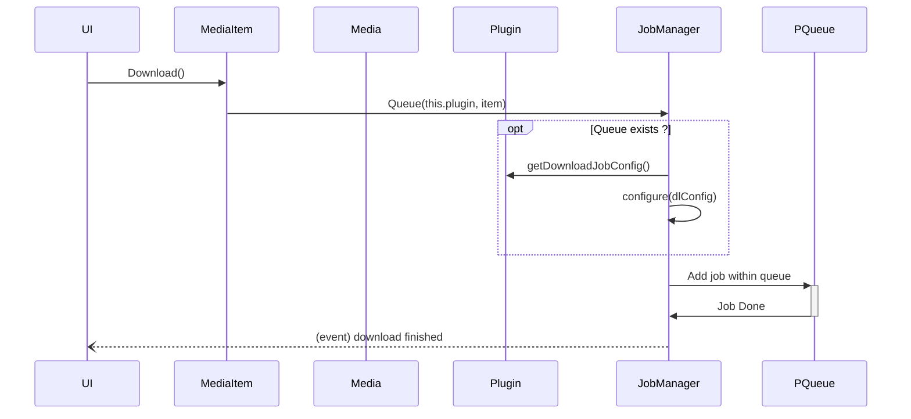
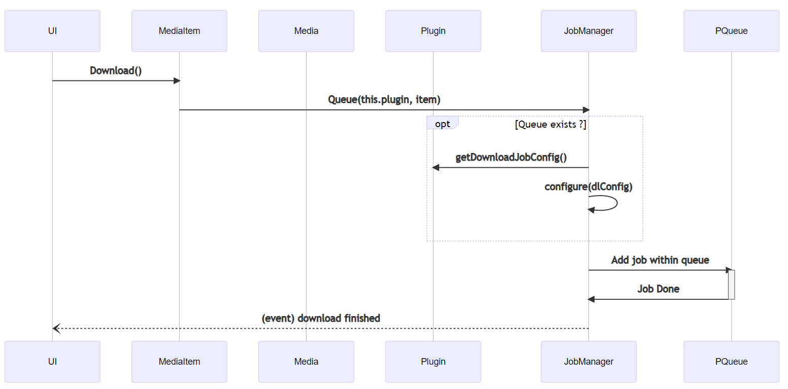

## Flow -> MediaItem call JobManager

## Queues kinds

JobManager -> Only handle "downloads" jobs

Plugin -> Throttle interaction with website

### Connector website interaction priorities

getTitles > getChapters > getImages > displayImage(preview) > downloadImage(download)

### Downloads

- Plugin declares jobs to JobManager
- JobManager stores inside a pqueue(unique per plugin)
- PQueue config each queue from specific plugin configuration
