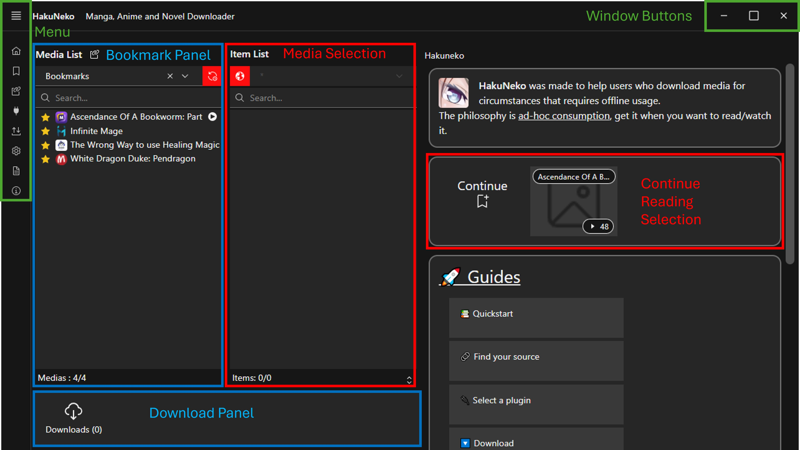

# User Interface Reference (Classic)

This front-end is focused for everyday users.

::: tip
Most UI elements will provide context help, so make sure to read the tooltip which will appear after a short delay when hovering the cursor over the corresponding UI element.
:::

## Layout

The fundamental functionality is provided within a fixed set of panels.
Additional functionalities or configurations can be found in the [Menu](#menu).

## Menu

## Application Settings

::: tip FOOTNOTES
[1] Make sure the _Media Directory_ is set correctly after the first launch of HakuNeko to prevent errors and confusion.
:::

## Bookmark Panel

## Download Panel

## Website Selection Panel

## Title Selection Panel

## Media Items Panel

## Media Preview

## Website Settings

## Developer Tools

The chrome developer tools can be opened by pressing the `F12` keyboard key.