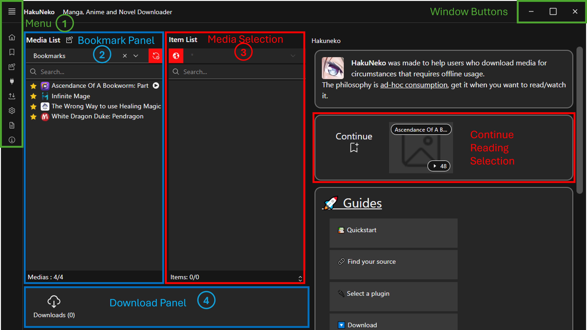
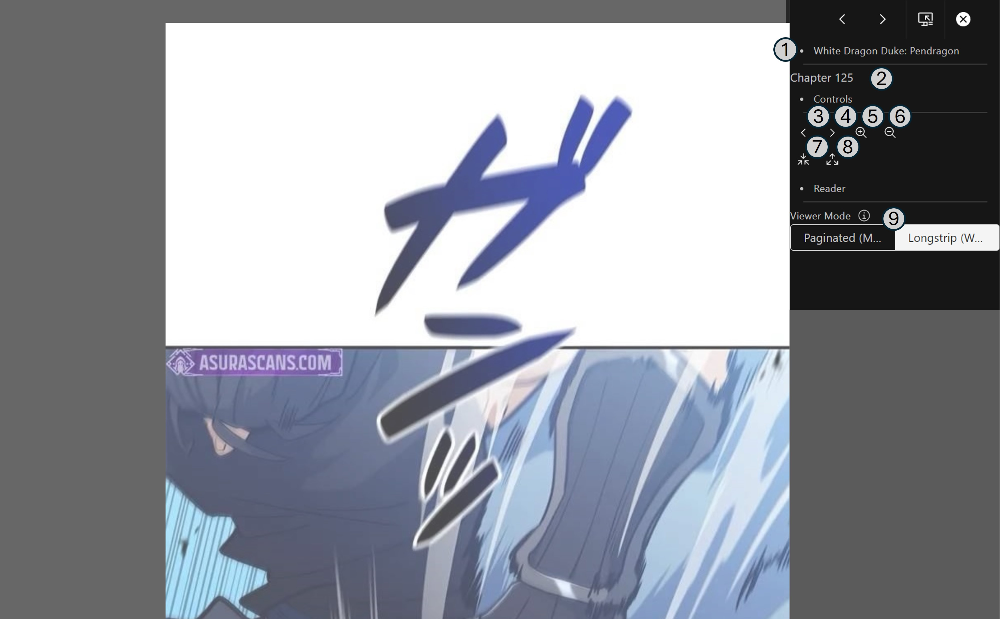

# User Interface Reference (Classic)

This front-end is focused for everyday users.

::: tip
Most UI elements will provide context help, so make sure to read the tooltip which will appear after a short delay when hovering the cursor over the corresponding UI element.
:::

## Layout

The fundamental functionality is provided within a fixed set of panels.
Additional functionalities or configurations can be found in the [Menu](#menu).

1. The top-left panel contains [system controls](#menu).
2. The [Manga List](#bookmark-panel) shows all available manga from different sources such as websites, bookmarks, clipboard, …​ 
   Furthermore it provides a simple search to filter the list.
3. The [Chapter List]() shows all available chapters for the currently selected manga from the manga list. 
   It also supports basic sorting and advanced filtering options.
4. The [Download Queue](#download-panel) panel shows the status and progress of all chapters that are currently downloading.

## Menu

The menu provides extended functionality and configuration.
To open the menu, click the corresponding icon in the upper left corner of the application.
To close the menu, click the button again or any space in the application other than the menu.

{style="width: 25%"}

1. The first menu entry is to get back to the home page.
2. Second entry is to get to the [Bookmark](#bookmark-panel) page.
3. Third is the [Paste Media URL](#paste-media-url) functionality.
4. Forth is to open the [Plugin Panel](#website-selection-panel).
5. Fifth is to [Import & Export](#import--export) functionality. 
   This can either be used to migrate all bookmarks from the previous version of HakuNeko (legacy) or to backup and restore the current list of bookmarks to/from a file.
6. Sixth provides an entry to open the [Settings](#application-settings) dialog. 
   It includes a dropdown menu.
7. Seventh is for [Help](). It includes a dropdown menu.
8. Eight is for [About](). It includes a dropdown menu.

## Bookmark Panel

### Media List Panel

1. Paste Media Link Button: 
   Use this button to load the manga links (e.g. https://mangadex.org/title/31013/eleceed) currently stored in the clipboard into the manga list. 
   This is useful to quickly drop manga downloads into HakuNeko while browsing manga websites with your browser.
2. It is also possible to browse manga lists directly in HakuNeko. 
   You can type here the name of your Source from which the manga shall be shown (if the list was updated). 
   There are also some special sources which are discussed later.
3. If a website is selected as source, the manga will be shown from a locally cached list. 
   To update the list use this synchronize button. 
   A refresh logo will appear at the place of the Manga List
4. Enter a search pattern to filter the manga list. 
   The pattern requires at least 3 characters to perform a search (or 2 with non-latin characters). 
   You can search by the title of a manga or by the source name.
5. With the bookmark button (the star) you can add or remove the selected manga from he manga list to the bookmark list.
6. A *Play* symbol will appear next to a bookmarked manga when there are unread chapters present.
7. The list of manga that are shown for the selected source and filtered by the search pattern. 
   Select a manga to load its chapters in the Chapter List.
8. The status bar may show an activity icon when the list is loading or synchronizing. 
   It also shows the number of filtered manga in the list and the total number of available manga for the selected source.

### Item List

The chapter list shows the chapters of the selected manga from the [Media List](#media-list-panel).

1. Use the sort button to toggle between different ordering of the chapters. The options are original, ascending, descending.
2. Choose a language to show only chapters of this selected language. 
   If the language option is not available than the site does not have multiple languages or that it was not coded yet (you can make a request on github).
3. Show only chapters that matches a given search pattern. Regular expressions are also supported.
4. The list of chapters that are shown for the selected source and filtered by the language and search pattern.
5. Each chapter has some controls and a title. 
   The download button will add the chapter to the download list and save it to the folder that is configured in the Settings. 
   The button has different appearances reflecting the current state. 
   See the tooltip for additional information. <!--Do the tooltip-->
   The preview button will show the pages of the chapter in the Preview Panel. 
   The marker logo keeps track of your last read chapter. 
   To change the read status of a chapter you will need to right click on the chapter and select the *Flag as* option than the read status of your need. 
   These features do not work in offline mode. <!--double check if this is still the case-->
6. The status bar may show an activity icon when the list is loading. 
   It also shows the number of filtered chapters in the list and the total number of available chapters for the selected manga.

Currently to download a chapter you need to right click on a chapter. <!--This will change in the future-->
A menu will appear with multiple options.
You can add to the download list one chapter at a time or add all chapters to the download list.
It will be downloaded to the folder that is configured in the Settings.

### Media Preview

Shows the pages or the video for the selected chapter in the [Item list](#item-list).
Downloaded chapters are shown from the local folder, otherwise the content is streamed directly from the website.

### Download Panel

Whenever a chapter is downloaded, it will be added to the download queue. 
The number in the parenthesis () shows the number of downloads that are queued in the list.
There will be two download slider present.
The first one shows how much of the current chapter is downloaded.
This progress bar roughly shows the percentage of the remaining data until the download is complete.
The second one shows chapters percentage that are to be download (in grey color), succeeded (in green color) or failed (in red color) and the one currently downloading (in blue color).

Clicking on the download panel will open up a second window with more information.

This download window first separates the downloads into its respective manga.
Than opening them up will show you which chapters were correctly downloaded and which failed.

At the top o the window you will find three buttons in the following order:

* *Clear Finished Tasks*
   
  This button will clear your download history of your successful downloads
* *Retry Failed Tasks*
   
  This button will retry to download chapters that failed to download
* *Delete All Tasks*
   
  This will clear your download history and queue

### Reader

To open the reader just click any of the pages from the [Preview Panel](#media-preview). 
The control panel is at the top right corner and will expand as soon as the cursor enters (hover).

You will found four buttons.

1. To go to the previous chapter.
2. To go to the next chapter.
3. To go to quick reader settings.
4. To close the reader.

Selecting the Quick Reader Settings will bring up the following settings and information.

1. The current name of the manga.
2. The current name of the chapter.
3. Navigate to the chapter that is below the current chapter in the chapter list without leaving the reader.
4. Navigate to the chapter that is above the current chapter in the chapter list without leaving the reader.
5. Increase the size of the pages.
6. Decrease the size of the pages.
7. Decrease the space between the pages. 
   This is useful to remove the gap when reading webtoons.
8. Increase the space between the pages.
9. Change the view mode.
    Paginated or longstrip

## Website Selection Panel

The source selection list can be reached by the corresponding control (number 4) in the [Manga List](#menu). 

Besides the website sources, there are certain sources with a special meaning.

In the plugin selection menu you can find several sorting options and other tools.

1. You can sort by Languages.
2. You can sort by Media type
3. You can sort by Site type
4. You have a search bar if you are looking for a specific site.
5. You can favorite sites, so that you can find them quicker.
   **This option is work in progress**
6. Open the site inside haru web browsing window.

For each site you can find its name, the website link and its associated tags.

### Title Selection Panel

### Website Settings

### Paste Media URL

## Import & Export 

## Application Settings

::: tip FOOTNOTES
[1] Make sure the _Media Directory_ is set correctly after the first launch of HakuNeko to prevent errors and confusion.
:::

## Developer Tools

The chrome developer tools can be opened by pressing the `F12` keyboard key.