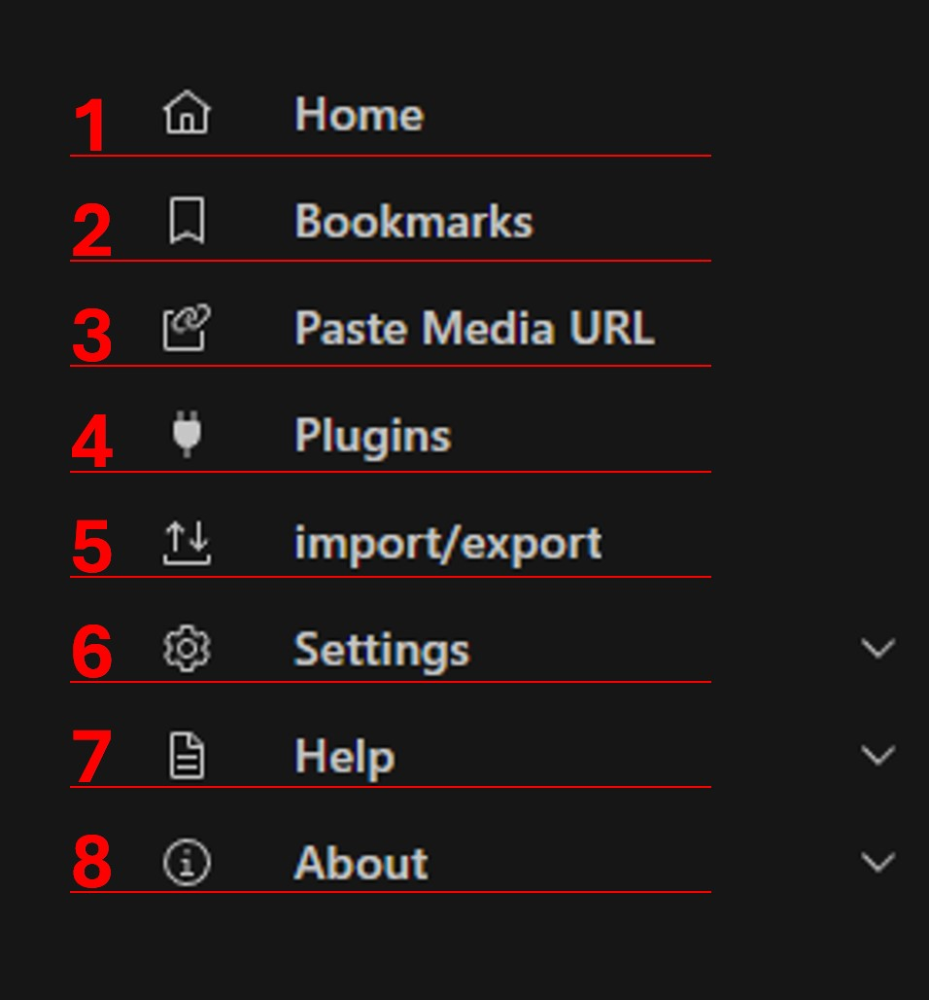

# User Interface Reference (Classic)

This front-end is focused for everyday users.

::: tip
Most UI elements will provide context help, so make sure to read the tooltip which will appear after a short delay when hovering the cursor over the corresponding UI element.
:::

## Layout

The fundamental functionality is provided within a fixed set of panels.
Additional functionalities or configurations can be found in the [Menu](#menu).

1. The top-left panel contains [system controls](#menu).
2. The [Manga List](#bookmark-panel) shows all available manga from different sources such as websites, bookmarks, clipboard, …​ Furthermore it provides a simple search to filter the list.
3. The [Chapter List]() shows all available chapters for the currently selected manga from the manga list. It also supports basic sorting and advanced filtering options.
4. The [Download Queue](#download-panel) panel shows the status and progress of all chapters that are currently downloading.

## Menu

The menu provides extended functionality and configuration.
To open the menu, click the corresponding icon in the upper left corner of the application.
To close the menu, click the button again or any space in the application other than the menu.

{style="width: 25%"}

1. The first menu entry is to get back to the home page.
2. Second entry is to get to the [Bookmark](#bookmark-panel) page.
3. Third is the [Paste Media URL](#paste-media-url) functionality.
4. Forth is to open the [Plugin Panel](#website-selection-panel).
5. Fifth is to [Import & Export](#import--export) functionality. This can either be used to migrate all bookmarks from the previous version of HakuNeko (legacy) or to backup and restore the current list of bookmarks to/from a file.
6.  Sixth provides an entry to open the [Settings](#application-settings) dialog. It includes a dropdown menu.
7.  Seventh is for [Help](). It includes a dropdown menu.
8.  Eight is for [About](). It includes a dropdown menu.

## Bookmark Panel

### Media List Panel

1. Use this button to load the manga links (e.g. https://mangadex.org/title/31013/eleceed) currently stored in the clipboard into the manga list. This is useful to quickly drop manga downloads into HakuNeko while browsing manga websites with your browser.
2. It is also possible to browse manga lists directly in HakuNeko. You can type here the name of your Source from which the manga shall be shown (if the list was updated). There are also some special sources which are discussed later.
3. If a website is selected as source, the manga will be shown from a locally cached list. To update the list use this synchronize button. A refresh logo will appear at the place of the Manga List
4. Enter a search pattern to filter the manga list. The pattern requires at least 3 characters to perform a search (or 2 with non-latin characters). You can search by the title of a manga or by the source name.
5. With the bookmark button (the star) you can add or remove the selected manga from he manga list to the bookmark list.
6. The list of manga that are shown for the selected source and filtered by the search pattern. Select a manga to load its chapters in the Chapter List.
7. The status bar may show an activity icon when the list is loading or synchronizing. It also shows the number of filtered manga in the list and the total number of available manga for the selected source.

### Media Preview

### Download Panel

## Website Selection Panel

### Title Selection Panel

### Website Settings

### Paste Media URL

## Import & Export 

## Application Settings

::: tip FOOTNOTES
[1] Make sure the _Media Directory_ is set correctly after the first launch of HakuNeko to prevent errors and confusion.
:::

## Developer Tools

The chrome developer tools can be opened by pressing the `F12` keyboard key.