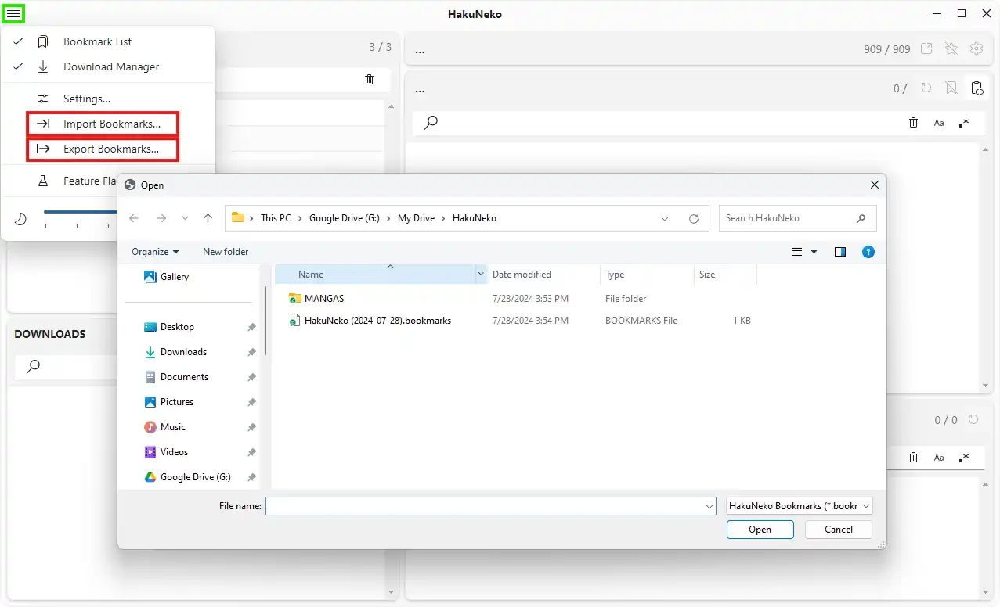
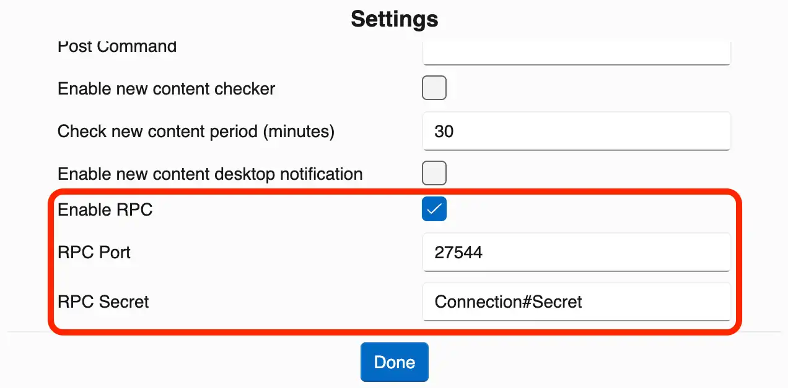
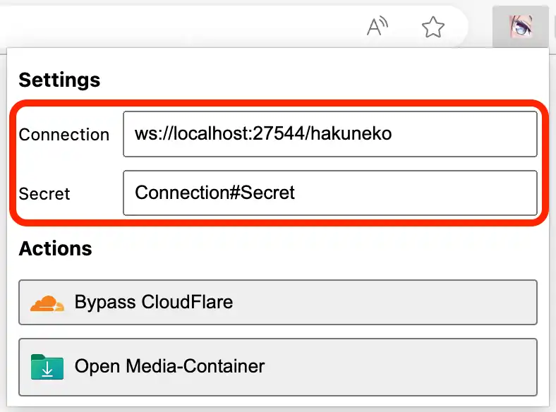

# Tutorials

## Preview/Download Media

Before downloading data, it is up to the user to determine which website shall be used to get the desired title.
For this example the title [Berserk](https://mangadex.org/title/801513ba-a712-498c-8f57-cae55b38cc92/berserk) from the MangaDex website will be used.

<iframe src="https://www.youtube.com/embed/Gs0BEJ7x9vo" width="100%" height="360" frameBorder="0" allowFullScreen></iframe>

1. First make sure to select a download directory in the settings where all downloaded titles shall be stored
2. Find and selet the website _MangaDex_
3. If the list of titles has not yet been synchronized or the list may be outdated, update the list now (depending on the selected website this may take some time)
4. Find and select the title _Berserk_
5. Load the list of current media items (chapters) for the title _Berserk_ from the website
6. Hover over a chapter in the media list and click the preview button to check the chapter content
7. Close the preview
8. Hover over a chapter in the media list again and click the download button to add this chapter to the download queue
9. Wait until the download is finished successfully
10. The download job may now be removed from the queue
11. Check the download directory

## Add/Remove Bookmark

...

<iframe src="https://www.youtube.com/embed/yDCkoHi9vKI" width="100%" height="360" frameBorder="0" allowFullScreen></iframe>

1. ...

## Import/Export Bookmarks

The bookmark import/export feature is useful for keeping backups, or migrating bookmarks from other/older versions (e.g., from HakuNeko Legacy).
The bookmark export will store all bookmarks from the application in an external JSON file.
The bookmark import will add bookmarks from the JSON file that do not exist in the application.
Bookmarks that exist in the application but are not present in the imported file will be kept and **not** be deleted.

1. Open the menu
2. Click the corresponding menu entry
3. In the file dialog navigate to the target directory
4. Select the bookmark file for import/export

## Apply URL from Browser

In some situations it may be useful to copy a link of a supported website title from the browser and paste it directly into HakuNeko (e.g., when updating the title list takes very long).
For this example the title [Berserk](https://mangadex.org/title/801513ba-a712-498c-8f57-cae55b38cc92/berserk) from the MangaDex website will be used.

::: warning IMPORTANT
Only links to titles of supported websites can be applied (see the list of supported websites).
Only links to titles are valid, links to chapters or episodes cannot be applied.
:::

<iframe src="https://www.youtube.com/embed/tgq9UmDtDso" width="100%" height="360" frameBorder="0" allowFullScreen></iframe>

1. In your browser navigate to the desired website and title
2. Copy the URL from the browser
3. Switch to HakuNeko
4. Press the _Paste_ button in the [Title Selection Panel](./ui-reference#title-selection-panel)
5. Wait until the link is processed and the [Media Items Panel](./ui-reference#media-items-panel) finished loading

## Setup HakuNeko Assistant (Browser Extension)

This extension can be used to control HakuNeko from within the browser.

| HakuNeko RPC Settings | Assistant RPC Settings |
| :-------------------: | :--------------------: |
|  |  |

1. Start HakuNeko and open the application settings
2. Enable the option for _Remote Control_
3. You may change the _Port_ on which HakuNeko can be accessed by 3rd party applications
4. You must change the default _Secret_ to prevent unauthorized connections
5. Install the HakuNeko Assistant browser extension for Chrome/Edge
6. Download the latest extension from [GitHub](https://github.com/manga-download/haruneko-assistant/releases)
7. Extract the content of the extension (zip archive) to a new arbitrary folder
8. Open your Chrome/Edge browser and switch to the extension manager
9. Enable the developer mode and load the extracted extension folder
10. Open the extension in your browser
11. Make sure the _Connection_ uses the same _Port_ number as configured in HakuNeko
12. Make sure the _Secret_ is the same as configured in HakuNeko

### Bypass CloudFlare

Various websites are protected by CloudFlare's Anti-Bot detection.
Unfortunately HakuNeko is detected as malicious browser and therefore has trouble to bypass the protection.
This workaround can be used to temporary access a website that is protected by CloudFlare.

::: warning IMPORTANT
Depending on the website the CloudFlare session may expire within 30 minutes ~ 30 days.
Therefore this workaround needs to be repeated in case the content of the website can no longer be accessed with HakuNeko.
:::

<iframe src="https://www.youtube.com/embed/nfgW2KT2EcE" width="100%" height="360" frameBorder="0" allowFullScreen></iframe>

1. Start HakuNeko and open the application settings
2. Make sure _Remote Control_ is enabled
3. Select the website that is protected by CloudFlare
4. Use the URL action in the [Website Selection Panel](./ui-reference#website-selection-panel) to open the website within HakuNeko
5. In case the website itself is not protected by CloudFlare, but the sub-pages are, then navigate to a page on the website that is protected by CloudFlare e.g., a manga or chapter
6. Try to solve the challenge/captcha
7. If the page loads correctly after solving the challenge/captcha
   - HakuNeko should now be able to access the content of the website (browser window can be closed)
   - All of the next steps are not necessary and can be skipped
8. If the page does not load and the website is stuck in an infinite challenge/captcha loop, close the browser window
9. Next open a web-browser with an installed [HakuNeko Assistant](#setup-hakuneko-assistant-browser-extension) extension
10. Navigate to the website/page that is protected by CloudFlare
11. Solve the challenge/captcha
12. Wait for the page to correctly being loaded
14. Open the _HauNeko Assistant Extension_ and press the button to bypass CloudFlare
15. Switch back to HakuNeko
16. In case a restart confiirmation appears, close and re-open HakuNeko
17. HakuNeko should now be able to access the content of the website

### Open Manga/Anime URL from Browser

...

<iframe src="https://www.youtube.com/embed/yqWX86uT5jM?mute=1" width="100%" height="360" frameBorder="0" allowFullScreen></iframe>

1. ...