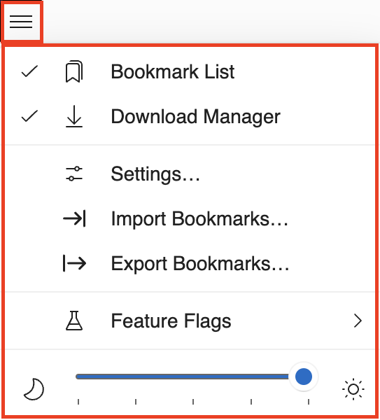
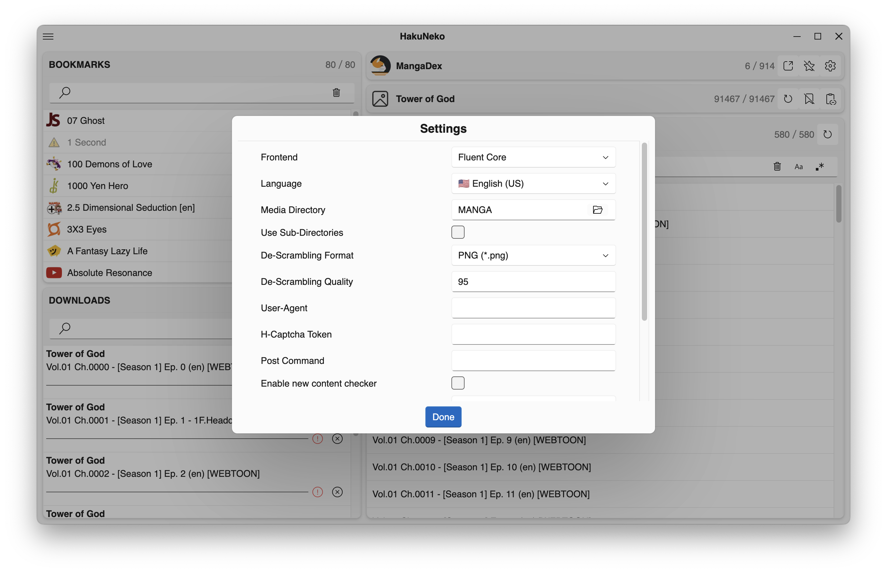
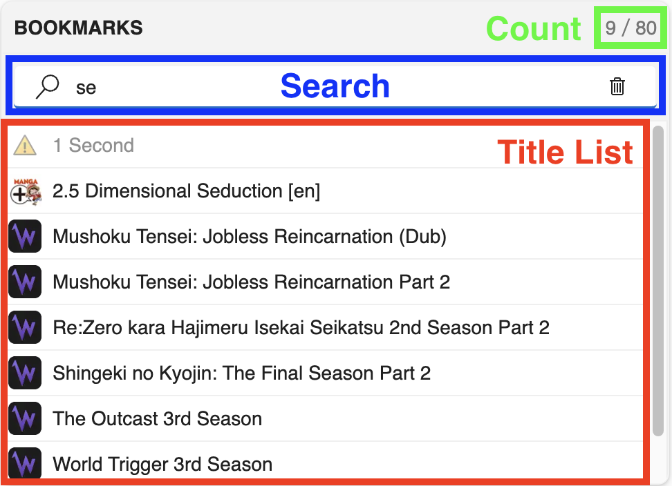
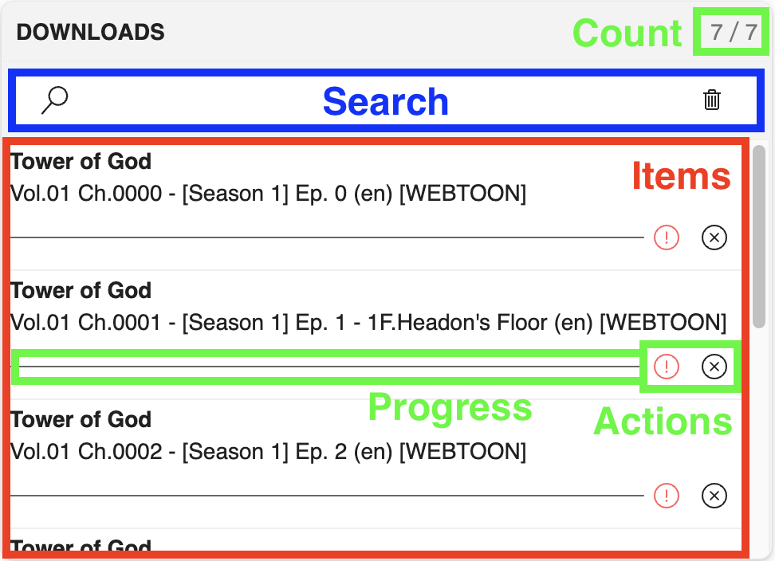
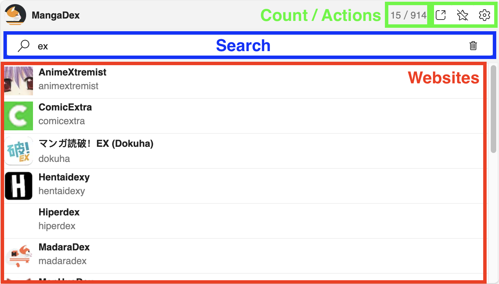
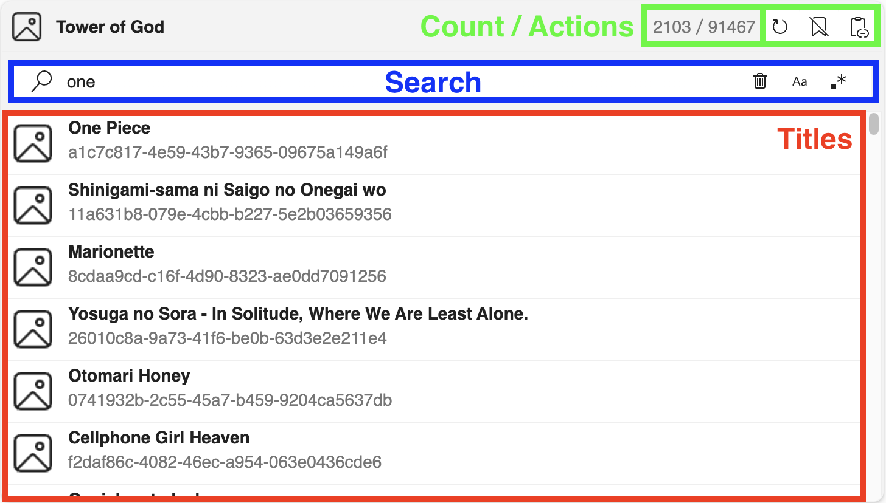
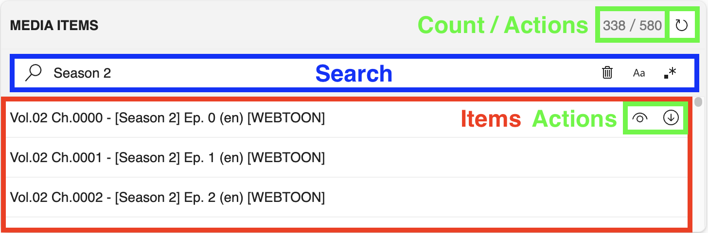
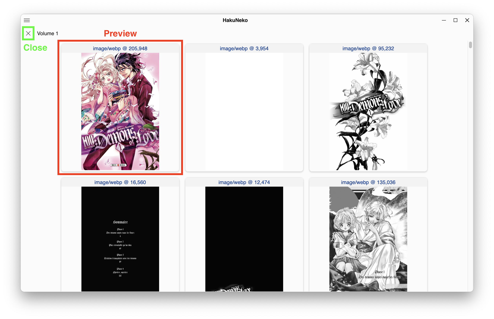
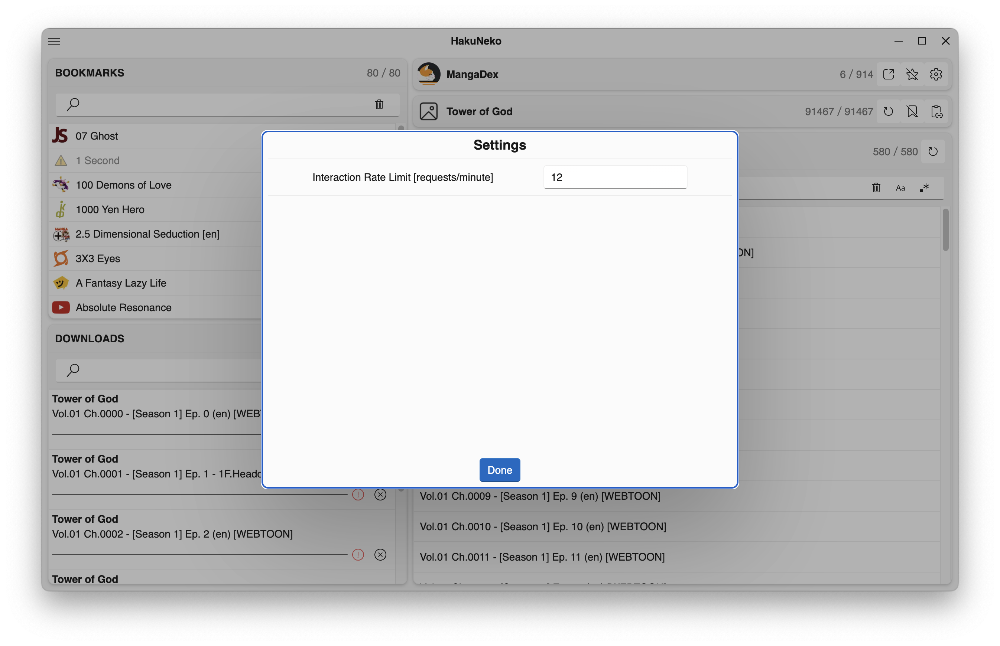

# User Interface Reference (Fluent-Core)

This front-end is focused on being used by developers.
It provides a specialized experience and tailored functionalities but lacks in general usability.

**ℹ️ Most UI elements will provide context help, so make sure to read the tooltip which will appear after a short delay when hovering the cursor over the corresponding UI element**

## Layout

The fundamental functionality is provided within a fixed set of panels.
Additional functionalities or configurations can be found in the [Menu](#menu).

## Menu

The menu provies extended functionality and configuration.
To open the menu, click the corresponding icon in the upper left corner of the application.
To close the menu, click the button again or any space in the application other than the menu.

The menu contains entries to toggle the visibility of the [Bookmark Panel](#bookmark-panel) and the [Download Panel](#download-panel). The menu also provides an entry to open the [Settings](#application-settings) dialog. There additional entries to import and export bookmarks. This can either be used to migrate all bookmarks from the previous version of HakuNeko (legacy) or to backup and restore the current list of bookmarks to/from a file. At the bottom is a slider for setting the brightness (dark/light mode) of this frontend (does not affect the other frontends).

There is also a sub-menu for toggling certain developer focused features on or of. These will not be further explained (check the corresponding tooltips).

## Application Settings

These settings can be reached via the [Menu](#menu).
This dialog contains all application specific options that can be configured by the user.

## Bookmark Panel

This panel shows the _Bookmark Manager_.

## Download Panel

This panel shows the _Download Manager_.

## Website Selection Panel

...

## Title Selection Panel

...

## Media Selection Panel

...

## Media Preview

...

## Website Settings

...

## Developer Tools

The chrome developer tools can be opened by pressing the `F12` keyboard key.