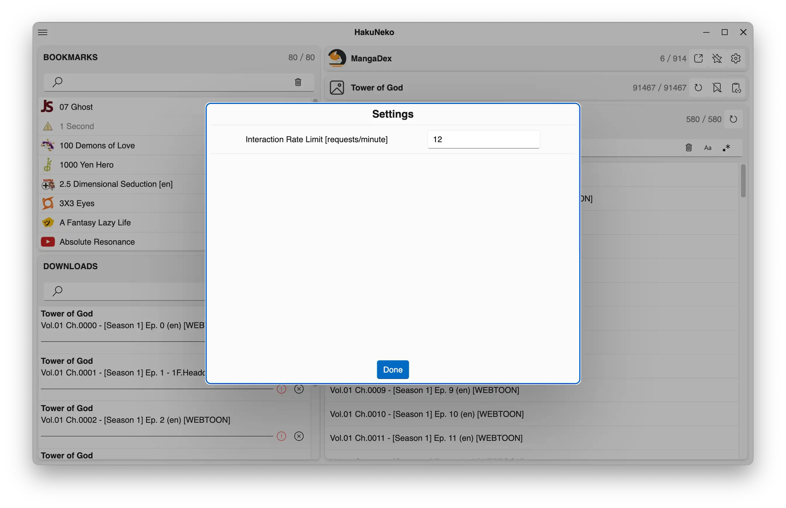

# User Interface Reference (Fluent-Core)

This front-end is focused on being used by developers.
It provides a specialized experience and tailored functionalities but lacks in general usability.

::: tip
Most UI elements will provide context help, so make sure to read the tooltip which will appear after a short delay when hovering the cursor over the corresponding UI element.
:::

## Layout

The fundamental functionality is provided within a fixed set of panels.
Additional functionalities or configurations can be found in the [Menu](#menu).

## Menu

The menu provies extended functionality and configuration.
To open the menu, click the corresponding icon in the upper left corner of the application.
To close the menu, click the button again or any space in the application other than the menu.

The menu contains entries to toggle the visibility of the [Bookmark Panel](#bookmark-panel) and the [Download Panel](#download-panel).
The menu also provides an entry to open the [Settings](#application-settings) dialog.
There additional entries to import and export bookmarks.
This can either be used to migrate all bookmarks from the previous version of HakuNeko (legacy) or to backup and restore the current list of bookmarks to/from a file.
At the bottom is a slider for setting the brightness (dark/light mode) of this frontend (does not affect the other frontends).

There is also a sub-menu for toggle certain developer focused features on/off.
These will not be further explained (check the corresponding tooltips).

## Application Settings

These settings can be reached via the [Menu](#menu).
This dialog contains all application specific options that can be configured by the user.
The dialog can be confirmed with the _Done_ button at the bottom center of the dialog.

| Label                         | Description |
| :---------------------------- | :---------- |
| Frontend                      | Shows a list of all available user interfaces. Select a user interface which delivers an appealing experience. A restart is required after changing the user interface. |
| Language                      | Shows a list of all available languages for the application. Select a language convenient for you. This does not affect languages of the accessed titles and media. |
| Media&nbsp;Directory&nbsp;⁽¹⁾ | The directory where all downloaded media shall be stored. |
| Use&nbsp;Sub-Directories      | ... |
| De‑Scrambling&nbsp;Format     | ... |
| De‑Scrambling&nbsp;Quality    | ... |
| ...                           | ... |
| RPC                           | ... |

::: tip FOOTNOTES
[1] Make sure the _Media Directory_ is set correctly after the first launch of HakuNeko to prevent errors and confusion.
:::

## Bookmark Panel

This panel shows the _Bookmark Manager_ and can be shown or hidden via the [Menu](#menu).
This list contains all titles from websites that were bookmarked by the user.
The counter in the top right corner shows the number of bookmarks in this list and the number of bookmarks which are currently filtered by applying the search.
The search field supports a simple text input that can be entered by the user.
Furthermore a clear button in the search box can be used to quickly reset the text input.

A bookmark in the list can be clicked to select its corresponding website in the [Website Selection Panel](#website-selection-panel) and select its corresponding title in the [Title Selection Panel](#title-selection-panel).

## Download Panel

This panel shows the _Download Manager_ and can be shown or hidden via the [Menu](#menu).
This list contains all media items that are downloaded since the start of the application.
The counter in the top right corner shows the number of downloads in this list and the number of downloads which are currently filtered by applying the search.
The search field supports a simple text input that can be entered by the user.
Furthermore a clear button in the search box can be used to quickly reset the text input.

Each download features a progress bar and additional action.
The first action represents the download status and may show any errors when clicked.
The second action cancels and removes the download from the download manager.

## Website Selection Panel

The purpose of this panel is to select a website which is required for all further actions.
Only websites which are shown in this list are supported by the software.
This is a collapsible panel that can be collapsed/expanded by clicking on the header.

In collapsed state it shows the currently selected websites, a counter and some actions.
The counter in the top right corner shows the number of websites in this list and the number of websites which are currently filtered by applying the search.
The first action opens the URL of the website in a new HakuNeko window.
Use this to browse the website, to check its availability (e.g., domain moved, region locked, ...) or to log in with a valid account.
The star action can be used to mark this website as favorite.
Each website may have individual [settings](#website-settings) such as timeouts and more, which can be changed by using the corresponding settings action.

In expanded state it shows an addtiional list of available websites and a search box.
The search field supports a simple text input that can be entered by the user.
Furthermore a clear button in the search box can be used to quickly reset the text input.

Click one of the websites in the list to select it (the name of the website will appear in the header section of this panel).

## Title Selection Panel

The purpose of this panel is to select a title (manga, anime) from a previously [selected website](#website-selection-panel).
This is a collapsible panel that can be collapsed/expanded by clicking on the header.

In collapsed state it shows the currently selected title, a counter and some actions.
The counter in the top right corner shows the number of titles in this list and the number of titles which are currently filtered by applying the search.
Use the synchronize action to load the latest list of titles from the website.
This needs to be done initially when the list of titles is still empty and regulary to update the list with added, removed or renamed titles.
With the bookmark action the currently selected title can be added to or removed from the [bookmark list](#bookmark-panel).
The last action is used to directly paste a website link to a specific title and select it.
::: warning IMPORTANT
The link must match a supported website and also point to a specific title such as manga or anime. Links to chapters or episodes cannot be used.
:::

In expanded state it shows an addtiional list of the last synchronized titles and a search box.
The search field supports a simple text input that can be entered by the user.
The search field has options which can be toggled on or off.
By turning on case sensitivity, the list is filtered by exactly matching the case of the entered text.
By turning on regular expressions, the entered text is interpreted as regular expression (JS flavor) which is used to filter the list.
Furthermore a clear button in the search box can be used to quickly reset the text input.

Click one of the titles in the list to select it (the name of the title will appear in the header section of this panel).

## Media Items Panel

The purpose of this panel is to list the media (chapter, episode) from a previously [selected title](#title-selection-panel).

The header of this panel shows a counter and an action.
The counter in the top right corner shows the number of media in this list and the number of media which are currently filtered by applying the search.
Use the synchronize action to load the latest list of media for the selected title from the website.
This needs to be done initially when the list of media is still empty.

The search field supports a simple text input that can be entered by the user.
The search field has options which can be toggled on or off.
By turning on case sensitivity, the list is filtered by exactly matching the case of the entered text.
By turning on regular expressions, the entered text is interpreted as regular expression (JS flavor) which is used to filter the list.
Furthermore a clear button in the search box can be used to quickly reset the text input.

Hover over one of the media items in the list to show the item actions.
Use the preview action to open the [Media Preview](#media-preview) for this media item.
Use the download action to add this item at the end of the download queue in the [Download Manager](#download-panel).

## Media Preview

This overlay shows a preview of the corresponding media item.
Depending on the media type the preview may differ.

For a manga chapter it shows thumbnails of all chapter images.
Each thumbnail contains the information of mime type and size and a small representation of the image.
The information can be clicked to open the original image data in a separate window.
The thumbnail image can be clicked to open the raw image data that was acquired by HakuNeko.

The close button at the top left corner can be used to exit the preview.

## Website Settings

A dialog with website specific settings can be accessed after [selecting a website](#website-selection-panel) and using the settings action.

## Developer Tools

The chrome developer tools can be opened by pressing the `F12` keyboard key.